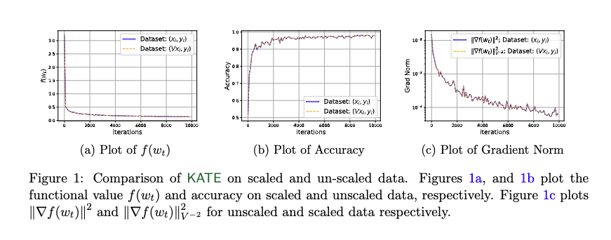
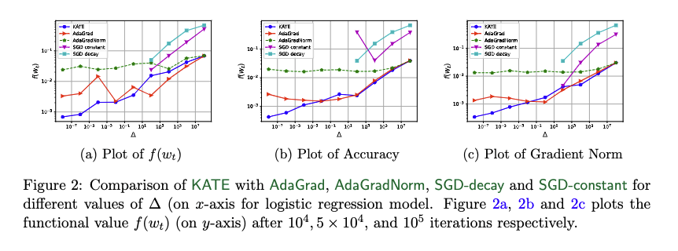
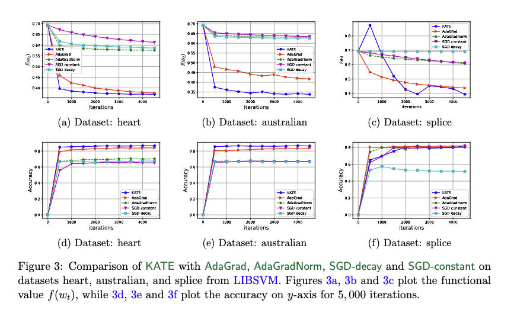

# Remove that Square Root: a New Efficient Scale-Invariant Version of AdaGrad

This repository documents the code to reproduce the experiments reported in the paper:
> Remove that Square Root: a New Efficient Scale-Invariant Version of AdaGrad

In this work, we introduce a novel optimization algorithm called KATE, a scale invariant adaptation of AdaGrad. Here we provide a screenshot of KATE's pseudocode from the paper.


In this repository we compare the performance of KATE with well-known algorithms like AdaGrad anbd ADAM on logistic regression, image classification and text classification problems. If you use this code for your research, please cite the paper as follow

```

```

## Table of Contents

<!--ts-->
   * [Requirements](#requirements)
   * [Logistic Regression](#logistic-regression)
      * [Scale Invariance](#scale-invariance)
      * [Robustness of KATE](#robustness-of-KATE)
      * [Performance of KATE on Real Data](#performance-of-KATE-real-data)
   * [Training of Neural Network](#neural-network)
     * [Image Classification](#image-classification)
     * [Text Classification](#text-classification)
<!--te-->

## Requirements
```setup
conda env create -f environment.yml
```

## Logistic Regression

### Scale Invariance 

In Figure 1 of our paper, we compare the performance of KATE on scaled and un-scaled data and empirically show the scale-invariance property. Please run the code in [KATEscaleinvariance.py](logistic_regression/KATEscaleinvariance.py) to reproduce the plots of Figure 1.



### Robustness of KATE

In Figure 2 of our paper, we compare the performance of KATE with AdGrad, AdaGradNorm, SGD-Decay and SGD-constant to examine the robustness of KATE. Please run the code in [RobustKATE.py](logistic_regression/RobustKATE.py) to reproduce the plots of Figure 2.



### Performance of KATE on Real Data

In Figure 3 of our paper, we compare the performance of KATE with AdGrad, AdaGradNorm, SGD-Decay and SGD-constant on real data. Please run the code in [KATEheart.py](logistic_regression/KATEheart.py), [KATEaustralian.py](logistic_regression/KATEaustralian.py) and [KATEsplice.py](logistic_regression/KATEsplice.py) to reproduce the performance of KATE on heart, australian and splice dataset, respectively.




## Notebooks
To reproduce the results of the paper, run the train notebook, then run corresponding plot notebook.
