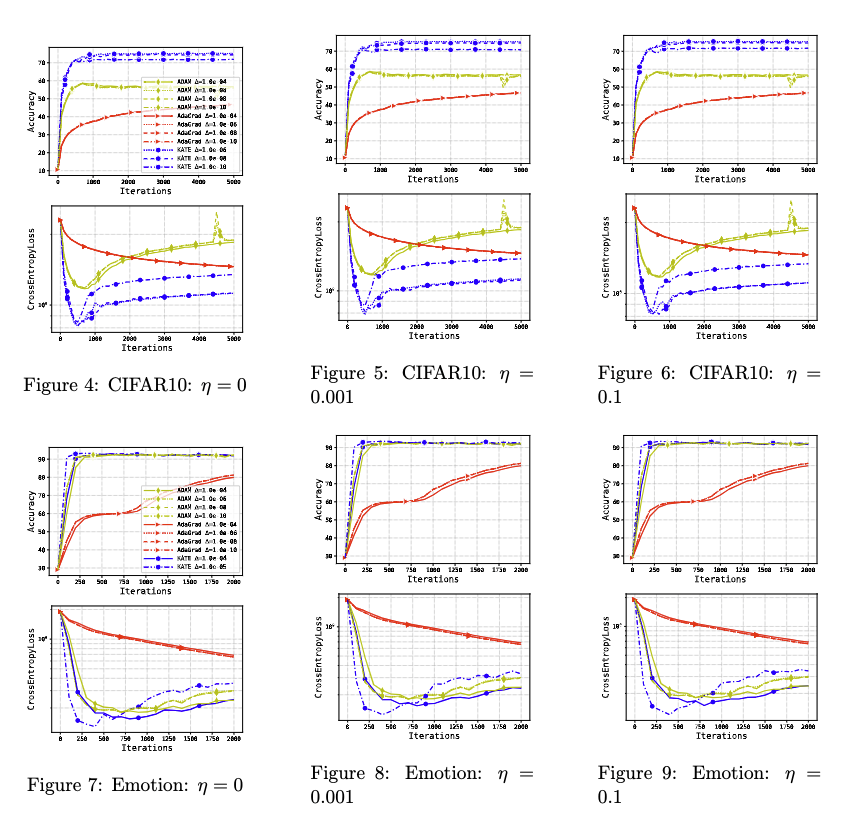

# [Remove that Square Root: A New Efficient Scale-Invariant Version of AdaGrad](https://arxiv.org/abs/2403.02648)

This repository documents the code to reproduce the experiments reported in the paper:
> [Remove that Square Root: A New Efficient Scale-Invariant Version of AdaGrad](https://arxiv.org/pdf/2403.02648.pdf)

In this work, we introduce a novel optimization algorithm called KATE, a scale-invariant adaptation of AdaGrad. We provide a screenshot of KATE's pseudocode from the paper.


In this repository, we compare the performance of KATE with well-known algorithms like AdaGrad and ADAM on logistic regression, image classification and text classification problems. If you use this code for your research, please cite the paper as follows

```
@article{choudhury2024remove,
  title={Remove that Square Root: A New Efficient Scale-Invariant Version of AdaGrad},
  author={Choudhury, Sayantan and Tupitsa, Nazarii and Loizou, Nicolas and Horvath, Samuel and Takac, Martin and Gorbunov, Eduard},
  journal={arXiv preprint arXiv:2403.02648},
  year={2024}
}
```

## Table of Contents

<!--ts-->
   * [Requirements](#requirements)
   * [Logistic Regression](#logistic-regression)
      * [Scale Invariance](#scale-invariance)
      * [Robustness of KATE](#robustness-of-KATE)
      * [Performance of KATE on Real Data](#performance-of-KATE-on-real-data)
   * [Training of Neural Network](#training-of-neural-network)
     * [Image Classification](#image-classification)
     * [Text Classification](#text-classification)
<!--te-->

## Requirements
The anaconda environment can be easily created by the following command:
```setup
conda env create -f environment.yml
```

## Logistic Regression

### Scale Invariance 

In Figure 1 of our paper, we compare the performance of KATE on scaled and un-scaled data and empirically show the scale-invariance property. Please run the code in [KATEscaleinvariance.py](logistic_regression/KATEscaleinvariance.py) to reproduce the plots of Figure 1.


### Robustness of KATE

In Figure 2 of our paper, we compare the performance of KATE with AdGrad, AdaGradNorm, SGD-Decay and SGD-constant to examine the robustness of KATE. Please run the code in [RobustKATE.py](logistic_regression/RobustKATE.py) to reproduce the plots of Figure 2.


### Performance of KATE on Real Data

In Figure 3 of our paper, we compare the performance of KATE with AdGrad, AdaGradNorm, SGD-Decay and SGD-constant on real data. Please run the code in [KATEheart.py](logistic_regression/KATEheart.py), [KATEaustralian.py](logistic_regression/KATEaustralian.py) and [KATEsplice.py](logistic_regression/KATEsplice.py) to reproduce the performance of KATE on heart, australian and splice dataset, respectively.


## Training of Neural Network

In Figure 4 of our paper, we compare the performance of KATE with AdGrad and ADAM on two tasks. 

- **Image Classification**: For training ResNet18 in CIFAR10 dataset.

- **Text Classification**: BERT fine-tuning on the emotions dataset from the Hugging Face Hub.

Please run the code in [train.ipynb](train.ipynb) to reproduce the plots for these two tasks.


