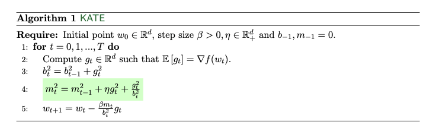

# Remove that Square Root: a New Efficient Scale-Invariant Version of AdaGrad

This repository documents the code to reproduce the experiments reported in the paper:
> Remove that Square Root: a New Efficient Scale-Invariant Version of AdaGrad

In this work, we introduce a novel optimization algorithm called KATE, a scale invariant adaptation of AdaGrad. Here we provide a screenshot of KATE's pseudocode from the paper.



In this repository we compare the performance of KATE with well-known algorithms like AdaGrad anbd ADAM on logistic regression, image classification and text classification problems. If you use this code for your research, please cite the paper as follow

```

```

## Table of Contents

<!--ts-->
   * [Installation](#installation)
   * [Logistic Regression](#logistic-regression)
      * [Scale Invariance](#scale-invariance)
      * [Robustness of KATE](#robustness-KATE)
      * [Performance of KATE on Real Data](#KATE-real-data)
   * [Training of Neural Network](#neural-network)
     * [Image Classification](#image-classification)
     * [Text Classification](#text-classification)
<!--te-->


## Requirements
```setup
conda env create -f environment.yml
```

## Notebooks
To reproduce the results of the paper, run the train notebook, then run corresponding plot notebook.
